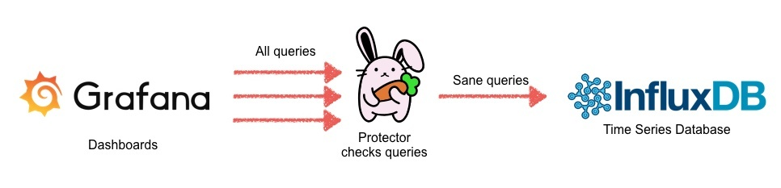

# Protector

[](https://travis-ci.org/trivago/Protector)


A circuit breaker for Time Series Databases like InfluxDB

## Introduction

This project aims to create a protection mechanism for time series databases.
It prevents malicious queries that could overload the browser or the database itself.
**Currently only InfluxDB 0.8 is supported**. But other databases could be added as well.

Goals:

* Prevent malicious queries to Time Series Databases (e.g. InfluxDB) that could bring it down by running out of memory.
* Prevent the Browser from freezing because of too many incoming datapoints.
* Provide helpful error messages for rejected queries.

Protector is supposed to be **running between your dashboard solution and the database**.  
For example, you should point Grafana to Protector instead of InfluxDB to filter the queries: 



For more information on why we built this tool, please read our announcement post on the trivgo techblog.


## How it works

Protector checks each query against a list of rules before it even reaches the database.  
Filtered queries will not be executed at all and an error message will be returned instead.  
Rules can be specified in your `config.yaml`.

You can show a description of all available rules with `protector --show_rules`.
Here's the current list of rules:

#### Prevent negative group by statements (`negative_groupby_statement`) ####
Negative group by statements lead to undefined behavior.
They can even bring down the server. That's why they are forbidden.

#### Prevent drop queries (`prevent_drop`) ####
Drop queries mean data loss. This is a risky operation that should be restricted to admin users

#### Prevent delete queries (`prevent_delete`) ####
Deleting data can be a very expensive operation. This should not be done in InfluxDB 0.8 and before.
See: https://influxdb.com/docs/v0.8/api/query_language.html#deleting-data-or-dropping-series

#### Prevent series names that end with a dot (`series_endswith_dot`) ####
Such series usually indicate that the query is unfinished and 
was executed by accident. To avoid the error, just remove the dot 
or add another word (e.g. 'my.graphite.series.' -> 'my.graphite.series')

#### Prevent too many datapoints per query (`too_many_datapoints`) ####
Such queries can bring down the time series database
or overload the client with too much data transferred over the wire.

#### Prevent queries for short series names (`short_series_name`) ####
The shorter the regex for the series name, the more series names get potentially matched.
This is a huge performance hit for InfluxDB.

#### Prevent querying for very old data (`query_old_data`) ####
Such queries can bring down the time series database
because it needs to open and parse very old shards from disk


## Whitelisting

You can whitelist series names in the config. Queries for series names matching one of the patterns are always executed without any previous checking. This is useful if you want to allow all queries for [Grafana annotations](http://docs.grafana.org/reference/annotations/) for example. Look at `config.yaml` for some sample patterns. 

## Usage

You can either run Protector as a Docker container or as a stand-alone Python application.

But first, please create a `config.yaml` which includes all your settings.
We've added a sample config file that should get you started.
Please make sure to adjust the `backend_host` and `backend_port` to point to your database

### Option 1: Running as a stand-alone application

You need to have Python 2.7 installed on your server

```Python
pip install protector
protector -c config.yaml
```

### Option 2: Running as a Docker container

Start the container in the same directory where your `config.yaml` is located:

```
docker run -it -v `pwd`:config trivago/protector
```

### Wiring up

After you've started Protector, point all your user-facing endpoints (e.g. Grafana) to Protector instead of InfluxDB.  
That should do the trick.


## Commandline options

You can overwrite the following settings from the command-line:

```
usage: protector [-h] [--host HOST] [--port PORT]
                   [--backend_host BACKEND_HOST] [--backend_port BACKEND_PORT]
                   [-c CONFIGFILE] [-v] [--show_rules] [-f] [--version]
                   [{start,stop,status,restart}]

Protector - A circruit breaker for Time Series Databases

positional arguments:
  {start,stop,status,restart}
                        One of the following options:
                        start: Start the daemon (default)
                        stop: Stop the daemon
                        status: Show current status
                        restart: Restart the daemon

optional arguments:
  -h, --help            show this help message and exit
  --host HOST           Hostname to bind to (default: localhost)
  --port PORT           Port to bind to (default: 8888)
  --backend_host BACKEND_HOST
                        Hostname of Time Series Database (default: localhost)
  --backend_port BACKEND_PORT
                        Port of Time Series Database (default: 8086)
  -c CONFIGFILE, --configfile CONFIGFILE
                        Configfile path (default: None)
  -v, --verbose         Set verbosity level. Increase verbosity by adding a v:
                        -v -vv -vvv (default: 0)
  --show_rules          Show a list of available rules and quit
  -f, --foreground      Run in foreground. Don't daemonize on start.
  --version             Show version
```


## Performance

Protector can easily check hundreds of queries per second.
We included a load test that you can run yourself. Look into `docker-compose-integration.yml` for more info.


## Credits

Logo created by [Bradley Ashburn](https://thenounproject.com/bashburn/). Thanks for this!


## License

BSD-3
